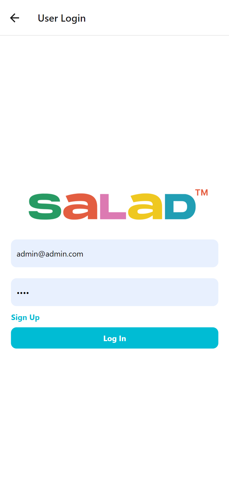
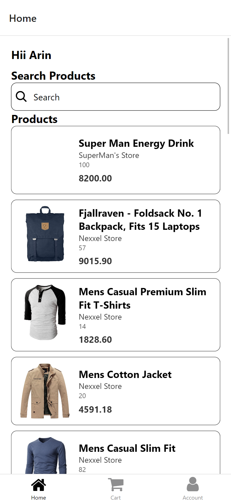
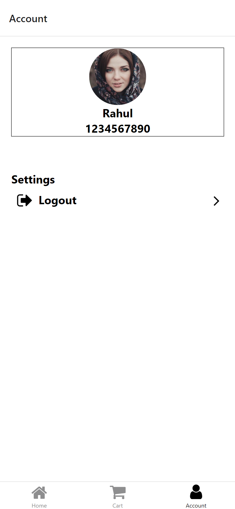
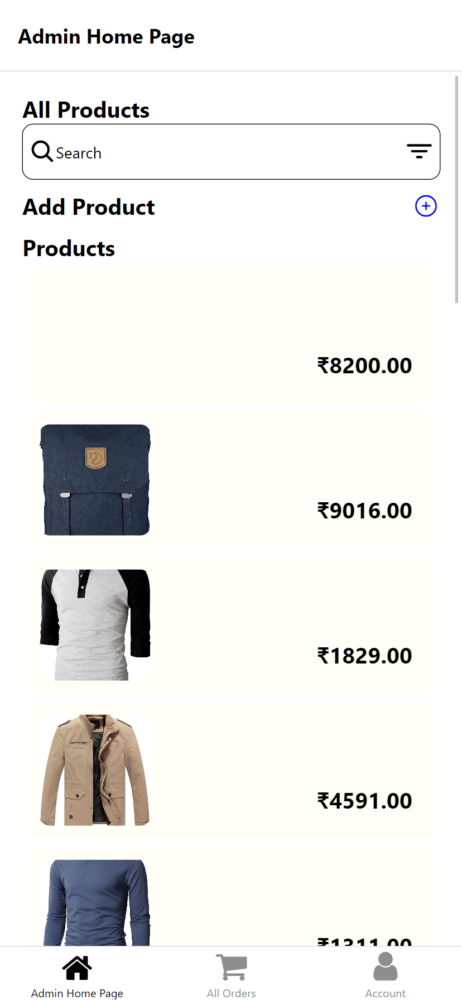
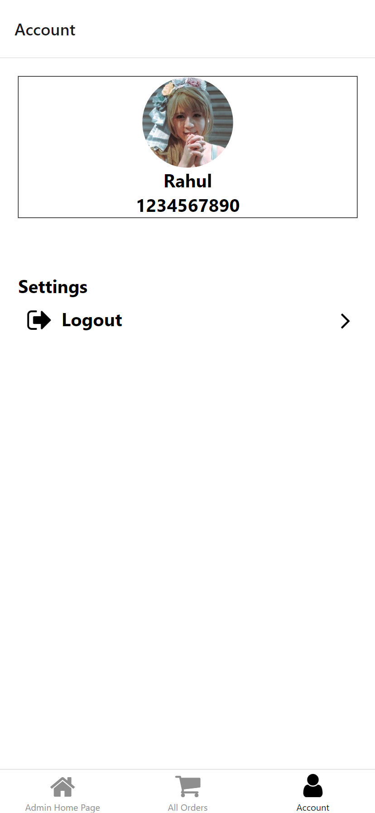

# How to start with app.
`
yarn add
yarn tunnel # unless you see andriod bunling complete, app won't load on the phone.
make sure that your computer is connect with charger.
`
# Screen Shots

## Main Login Screen


## User Login Screen && Admin Login Screen


## User Signup Screen
..pending.

## User Home Screen



## User Profile Screen


## Admin Home Screen


## Admin Profile Screen



<!-- expo andriod download link -->
# Download Link
<!-- andriod apk -->
[Android's Download Link 🔗](https://expo.io/artifacts/3b1b1b0a-1f9a-4b0f-9b1a-1f9a4b0f9b1a)


# Explainging Navigation.
the app has a root component `<NavigationContainer></NavigationContainer>` and another thing is `createNavigation-stack-bottom` any thing can be present, after making an instance of `createNavigation-stack-bottom` we can pass it to `<NavigationContainer></NavigationContainer>` as a children.
```tsx
const RootStack= createBottomTabNavigator();
const App = () => {
  return (
    <NavigationContainer>
      <Stack.Navigator>
        <Stack.Screen name="Home" component={HomeScreen} />
        <Stack.Screen name="Settings" component={SettingsScreen} />
      </Stack.Navigator>
    </NavigationContainer>
  );
};
```
